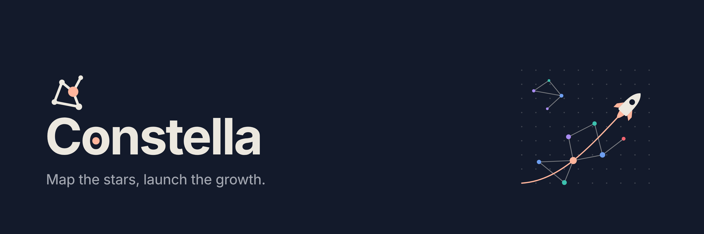
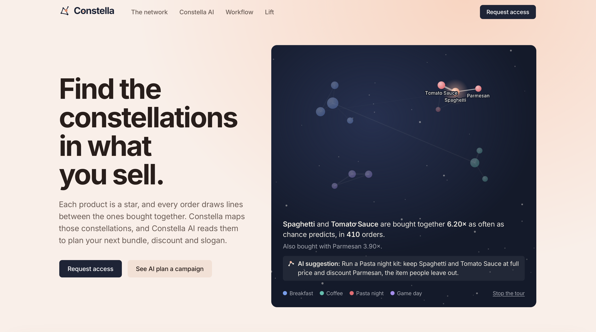
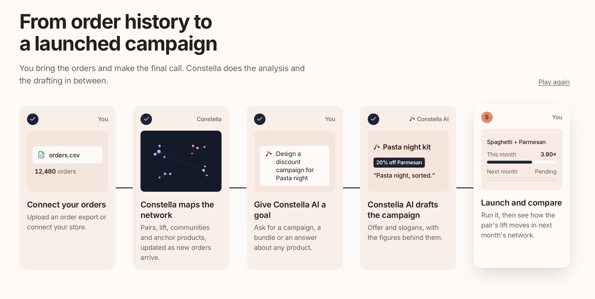
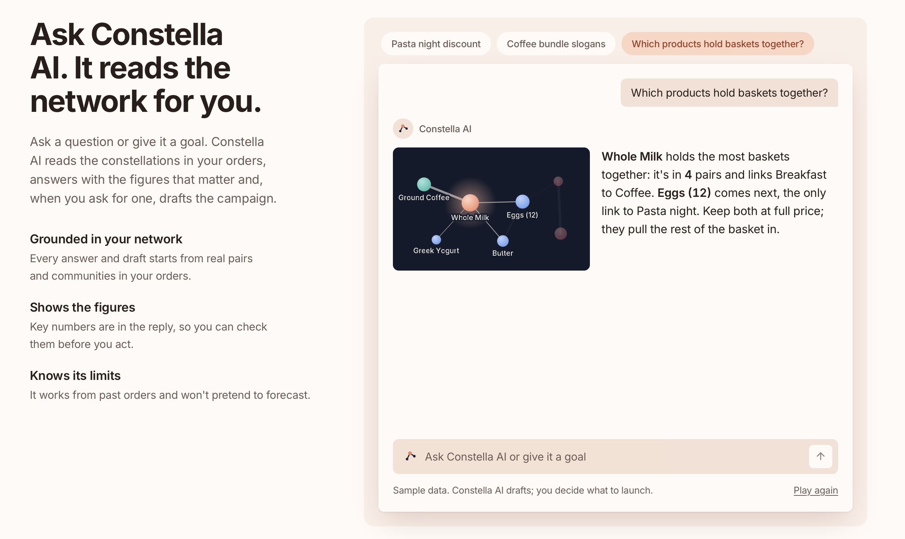
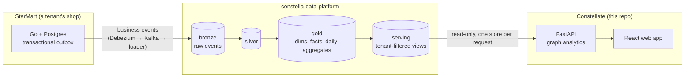

# Constellate



**Find the constellations in what you sell.**



Constella is a sales-analytics app for shops. Most sales reports show *what* sells; Constella shows *what sells together*. It turns order history into a network of products: which pairs are bought together more often than chance, which products form natural groups ("communities"), and which products are the bridges holding the store's baskets together. On top of that network, **Constella AI** answers questions in plain words and drafts bundles, discount campaigns and slogans, with every figure traceable to the data.

This repository holds the **API and the web app**. It's one of three repositories that make up the Constella platform (see [Architecture](#architecture)).

## What you can do with it

| Page | What it shows |
|---|---|
| **Home** | The last 7 days against the 7 before (revenue, orders, average basket), the week's top sellers, and a generated overview naming a rising pair, a falling pair and a discount opportunity. |
| **Network** | The product network for any period (30 days, 90 days, 12 months) and customer segment. Three views: **Pairs** (lift, confidence, co-orders), **Bridges** (articulation points: take one away and the network splits) and **Communities** (Louvain clusters). Insights are written from the graph on screen. |
| **Products** | Every product with 12 weeks of sales, trend, share of orders and strongest pair, plus a pair heat map. |
| **Constella AI** | Ask about products, pairs, communities, trends or customer segments; get answers with sourced figures, a "how this was worked out" trace, and campaign drafts you can save. |
| **Report** | A one-click business report: KPIs, strongest pairs, communities, bridge products, campaign results and prioritised recommendations. Printable. |
| **Campaigns** | Draft, schedule, pause and end campaigns, and compare actual orders with the expected line. |

Customer segments are RFM groups (champions, loyal, potential, new, at risk, hibernating), so every view can be filtered to, for example, what your champions buy together.




## Architecture

Constella is split into three repositories, with a clear contract between each pair:



| Repository | Role |
|---|---|
| [StarMart](https://github.com/super-aderx/StarMart) | The online grocery shop (one deployment per tenant) that produces orders and publishes business events. |
| [constella-data-platform](https://github.com/super-aderx/constella-data-platform) | The warehouse: raw events in, then dbt models build silver, gold and the `serving` views. Until StarMart is live, a deterministic event generator stands in for it with two demo stores. |
| **Constellate** (this repo) | The API, which reads only the `serving` views, and the web app. |

Key design choices:
- **Multi-tenant from the start.** Every request is scoped to one store. The API sets the store on the database transaction, the serving views filter on it, and every query also filters by store explicitly, so a mistake in one layer can't leak another store's data.
- **Additive aggregates, ratios at query time.** The warehouse stores only daily counts and sums per segment. Support, confidence and lift are computed from summed counts for any date range, so every range and segment combination is exact.
- **Graph analytics on request.** Communities (Louvain, fixed seed), degree, strength and betweenness are computed per request with NetworkX; communities are labelled after their most connected products.
- **The serving contract is the boundary.** The API's tests run against a throwaway copy of that contract, so each repository's CI stands on its own.

## Tech stack

| Area | Stack |
|---|---|
| API | Python 3.14, FastAPI, Pydantic, psycopg 3 (connection pool), NetworkX |
| Web app | React 19, TypeScript, Vite 8 with the React Compiler, Tailwind CSS v4, shadcn/ui on Radix |
| Warehouse | Postgres 17, dbt, built in [constella-data-platform](https://github.com/super-aderx/constella-data-platform) |
| Quality | pytest against a fixture warehouse, ruff, oxlint, TypeScript, prek git hooks, GitHub Actions, SonarCloud |

## Getting started

You need Docker, [uv](https://docs.astral.sh/uv/) and Node 22.12+.

**1. Start the warehouse** (in the `constella-data-platform` repo):

```bash
cp .env.example .env
docker network create constella-net     # once
docker compose up -d warehouse
cd warehouse && uv sync
uv run --env-file ../.env python -m generator --tenant all --reset
cd dbt && uv run --env-file ../../.env dbt deps && uv run --env-file ../../.env dbt build
```

**2. Run the API** (this repo):

```bash
cd backend
cp .env.example .env
uv sync
uv run --env-file .env fastapi dev app/main.py     # http://localhost:8000/docs
```

**3. Run the web app:**

```bash
cd frontend/constella-frontend
npm install
npm run dev                                         # http://localhost:5173/#/home
```

The demo store is **Harbor Street Market**. To see the second demo store, start the web app with `VITE_TENANT_KEY=maple-corner npm run dev`.

**Tests.** The API tests build their own small warehouse in any Postgres 17 (they never touch your data):

```bash
docker run -d --name constella-test-pg -p 5434:5432 -e POSTGRES_PASSWORD=postgres postgres:17
cd backend && uv run --env-file .env pytest
```

## Project status

| | Status |
|---|---|
| Warehouse-backed analytics (Home, Network, Products, Report figures) | Live, from the warehouse |
| Constella AI | Answers are written by a scripted engine from real data today. Real AI answers with checked figures (OpenAI, one call per question, English and 繁體中文) are in progress, starting with the API contracts. |
| Campaigns | Simulated until the warehouse holds promotion data |
| Sign-in and user accounts | Not yet; a demo account is used |

## Repository layout

```
backend/                    FastAPI app
  app/api/v1/               HTTP routes (store, segments, network, products, sales, summary)
  app/services/             graph analytics, sales, money formatting
  app/repository.py         all SQL, against the serving views only
  tests/                    API tests on a fixture warehouse
frontend/constella-frontend/
  src/features/             one folder per page (home, network, products, ask, report, campaigns, landing)
  src/components/           reusable graph, chart, assistant and control components
  src/data/                 API client and the store's data
.github/workflows/          CI: hooks, backend, frontend
```

[`CLAUDE.md`](CLAUDE.md) has the detailed conventions for working in the codebase.

## How it's built

Features are specified and shipped with two Claude Code plugins of my own, from the [GoGoAderx](https://github.com/super-aderx/GoGoAderx) marketplace:
- **aderx-pm** takes an idea to requirements, a technical plan grounded in this codebase, and parallelizable Linear tickets ([case study](https://github.com/super-aderx/GoGoAderx/blob/main/docs/aderx-pm-case-study.md)).
- **aderx-dev** takes a ticket to an approved spec, a test-first build checked by an independent verifier, and a reviewed pull request ([case study](https://github.com/super-aderx/GoGoAderx/blob/main/docs/aderx-dev-case-study.md)).

Every pull request runs the git hooks, the backend and frontend checks, and SonarCloud; `ci-passes` is the single required check.
